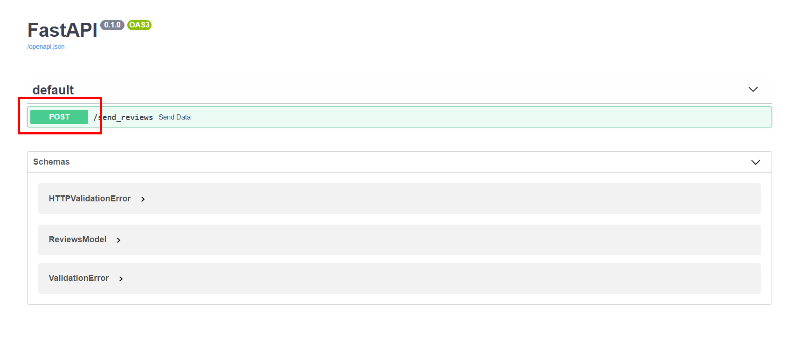
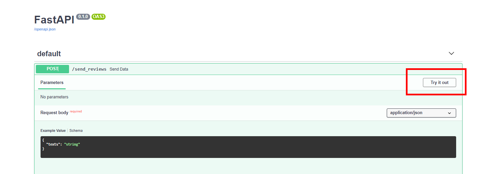

Web API for NER (Named Entity Recognition)
==========================================

What Is This?
-------------

This is a simple Python/FastAPI application intended to provide a working example of NER identifying functionality using Spacy. 

How To Use This
---------------

1. Navigate to file `/fastAPI-ner-project`.
2. Run `pip install -r requirements.txt` to install dependencies.
3. Run `uvicorn main:app --reload` to start the server.
4. Navigate to http://127.0.0.1:8000/docs in your browser.
5. Click on `POST`.
   
6. Click on `Try it out`.
   
7. Input the string to `"texts": "your_string"`
   
